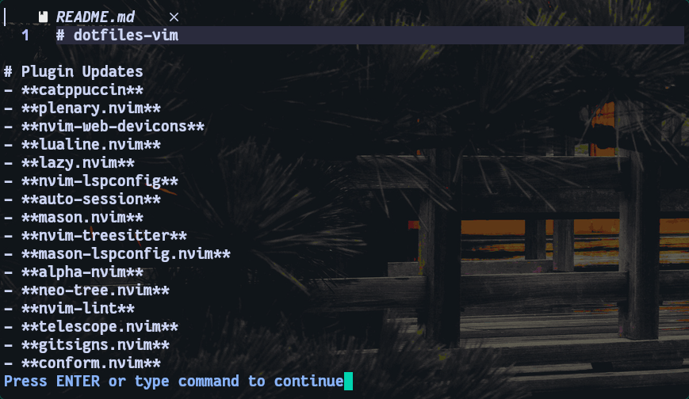

# dotfiles-vim


Personal editor dotfiles focused on a split workflow:

- Neovim for general editing and language learning
- IntelliJ IDEA + IdeaVim for Java and IDE-heavy workflows

The repo keeps real file paths so restoring to a new machine is simple.

## Workflow split

- Neovim stays generic, fast, and terminal-first.
- IntelliJ IDEA handles Java-heavy navigation, refactors, diagnostics, and completion.
- IdeaVim bridges IDE actions back into a Vim-style workflow.

## Requirements

- Linux environment
- Neovim `0.11+` with this repo currently tested on `0.12.3`
- Git, curl, and unzip
- `ripgrep`, `fd`, and `fzf` for the search workflow
- Node.js, npm, Python, and `pynvim` for the current plugin/tooling stack
- Clipboard support through `wl-clipboard` or `xclip`
- IntelliJ IDEA with the IdeaVim plugin for the Java side of the setup

## Recommended apps

- `kitty` for a clean terminal UI that matches the screenshots in this repo
- `tmux` to pair with `vim-tmux-navigator`
- JetBrains Toolbox for installing and updating IntelliJ IDEA
- A JDK 21+ distribution if you want Java support in IntelliJ
- `lazygit` if you want a lightweight terminal Git companion next to Neovim

## Included configs

- `.config/nvim`
- `.ideavimrc`
- `.config/JetBrains/IntelliJIdea2026.1/options/editor.xml`
- `.config/JetBrains/IntelliJIdea2026.1/options/vim_settings.xml`
- `.config/JetBrains/IntelliJIdea2026.1/keymaps/GNOME Proper Redo.xml`

## Repo layout

```text
.
├── .config/
│   ├── JetBrains/
│   │   └── IntelliJIdea2026.1/
│   │       ├── keymaps/
│   │       └── options/
│   └── nvim/
├── .ideavimrc
├── assets/
│   └── screenshots/
├── Makefile
├── scripts/
│   ├── bootstrap.sh
│   ├── install.sh
│   ├── sync-from-home.sh
│   └── update-plugins.sh
└── README.md
```

## Scripts

Install base packages, then copy the tracked config files into the matching paths under `$HOME`:

```bash
./scripts/bootstrap.sh
```

Or with `make`:

```bash
make bootstrap
```

Show the available maintenance commands:

```bash
make
```

Install repo contents back into the same paths under `$HOME`:

```bash
./scripts/install.sh
```

Or with `make`:

```bash
make install
```

Sync the latest local config from your machine back into the repo:

```bash
./scripts/sync-from-home.sh
```

Or with `make`:

```bash
make sync
```

Refresh Neovim plugins in an isolated temp environment, then write the new lockfile back into the repo:

```bash
./scripts/update-plugins.sh
```

Or with `make`:

```bash
make update-plugins
```

## Screenshots

### Neovim

Terminal editing snapshot with the current Neovim theme and UI stack:



### IntelliJ IDEA + IdeaVim

Current Java workflow snapshot:


## Plugin stack

Current Neovim plugins tracked in `lazy-lock.json`:

| Plugin | Role |
| --- | --- |
| `lazy.nvim` | plugin manager |
| `alpha-nvim` | start screen |
| `auto-session` | session restore |
| `blink.cmp` | completion engine |
| `friendly-snippets` | snippet collection |
| `bufferline.nvim` | buffer tabs |
| `catppuccin` | colorscheme |
| `conform.nvim` | formatting |
| `gitsigns.nvim` | git gutter signs |
| `indent-blankline.nvim` | indent guides |
| `lualine.nvim` | statusline |
| `mason.nvim` | external tooling manager |
| `mason-lspconfig.nvim` | Mason/LSP bridge |
| `neo-tree.nvim` | file explorer |
| `nui.nvim` | UI dependency for Neo-tree |
| `nvim-lint` | lint runner |
| `nvim-lspconfig` | LSP client setup |
| `nvim-treesitter` | syntax tree highlighting |
| `nvim-web-devicons` | file icons |
| `plenary.nvim` | Telescope dependency |
| `telescope.nvim` | fuzzy finder |
| `vim-tmux-navigator` | tmux pane navigation |
| `which-key.nvim` | keymap hints |

## Keymap highlights

### Shared Vim habits

- `Space` as leader
- `jk` to leave insert mode
- `<leader>nh` to clear search highlight
- `<leader>+` and `<leader>-` for increment/decrement
- `<leader>sv`, `<leader>sh`, `<leader>se`, `<leader>sx` for split management

### Neovim highlights

- `<leader>e` toggles Neo-tree
- `<leader>ff` and `<leader>fg` use Telescope for file and grep search
- `<Tab>` and `<S-Tab>` cycle buffers
- `<leader>fm` formats with Conform
- `<C-Space>` opens completion and `<CR>` confirms only when an item is explicitly selected
- `gd`, `gi`, `gt`, `<leader>ca`, `<leader>rn`, `[d`, `]d`, `K` come from LSP config

### IdeaVim + IntelliJ highlights

- `gd`, `gD`, `gi`, `gr`, `gt`, `K` call IntelliJ semantic navigation actions
- `<leader>rn` triggers IntelliJ rename
- `<leader>ca` opens intention actions / quick fixes
- `<leader>d`, `[d`, `]d` handle diagnostics through IntelliJ actions
- `<leader>sf`, `<leader>sg`, `<leader>ss` bridge into IntelliJ file/symbol/search flows
- `<leader>oi` optimizes imports and `<leader>f` reformats code

## Notes

- `vim_settings_local.xml` is intentionally excluded because it contains local jump and mark state.
- Neovim is kept generic; the repo no longer carries custom Java `jdtls` project wiring.
- IntelliJ completion popup and parameter info are enabled to preserve stronger IDE-native behavior.
- `scripts/bootstrap.sh` installs the basic CLI/editor dependencies but does not install IntelliJ IDEA itself.
- `scripts/update-plugins.sh` updates `lazy-lock.json` from a temporary XDG workspace so the repo lockfile can be refreshed without mutating your main Neovim data directory.

## Restore manually

If you do not want to use the scripts, copy files manually:

```bash
cp -a .config/nvim ~/.config/
cp .ideavimrc ~/.ideavimrc
cp .config/JetBrains/IntelliJIdea2026.1/options/editor.xml ~/.config/JetBrains/IntelliJIdea2026.1/options/
cp .config/JetBrains/IntelliJIdea2026.1/options/vim_settings.xml ~/.config/JetBrains/IntelliJIdea2026.1/options/
cp ".config/JetBrains/IntelliJIdea2026.1/keymaps/GNOME Proper Redo.xml" ~/.config/JetBrains/IntelliJIdea2026.1/keymaps/
```
