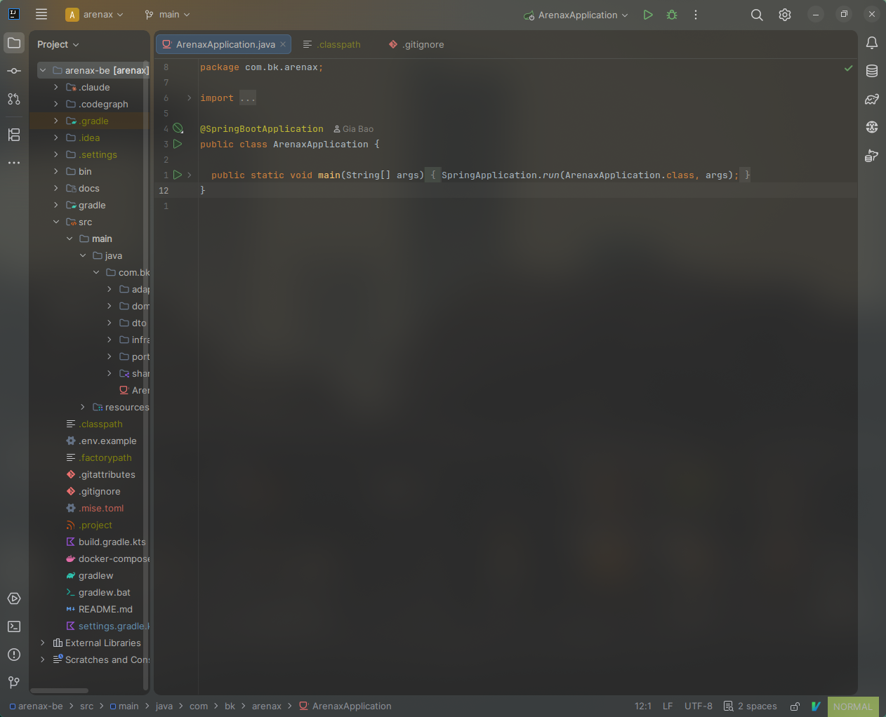

# dotfiles-vim

Personal editor dotfiles focused on a split workflow:

- Neovim for general editing and language learning
- IntelliJ IDEA + IdeaVim for Java and IDE-heavy workflows

The repo keeps real file paths so restoring to a new machine is simple.

## Included configs

- `.config/nvim`
- `.ideavimrc`
- `.config/JetBrains/IntelliJIdea2026.1/options/editor.xml`
- `.config/JetBrains/IntelliJIdea2026.1/options/vim_settings.xml`
- `.config/JetBrains/IntelliJIdea2026.1/keymaps/GNOME Proper Redo.xml`

## Repo layout

```text
.
├── .config/
│   ├── JetBrains/
│   │   └── IntelliJIdea2026.1/
│   │       ├── keymaps/
│   │       └── options/
│   └── nvim/
├── .ideavimrc
├── assets/
│   └── screenshots/
├── scripts/
│   ├── install.sh
│   └── sync-from-home.sh
└── README.md
```

## Scripts

Install repo contents back into the same paths under `$HOME`:

```bash
./scripts/install.sh
```

Sync the latest local config from your machine back into the repo:

```bash
./scripts/sync-from-home.sh
```

## Screenshots

### IntelliJ IDEA + IdeaVim

Current Java workflow snapshot:



## Keymap highlights

### Shared Vim habits

- `Space` as leader
- `jk` to leave insert mode
- `<leader>nh` to clear search highlight
- `<leader>+` and `<leader>-` for increment/decrement
- `<leader>sv`, `<leader>sh`, `<leader>se`, `<leader>sx` for split management

### Neovim highlights

- `<leader>e` toggles Neo-tree
- `<leader>ff` and `<leader>fg` use Telescope for file and grep search
- `<Tab>` and `<S-Tab>` cycle buffers
- `<leader>fm` formats with Conform
- `gd`, `gi`, `gt`, `<leader>ca`, `<leader>rn`, `[d`, `]d`, `K` come from LSP config

### IdeaVim + IntelliJ highlights

- `gd`, `gD`, `gi`, `gr`, `gt`, `K` call IntelliJ semantic navigation actions
- `<leader>rn` triggers IntelliJ rename
- `<leader>ca` opens intention actions / quick fixes
- `<leader>d`, `[d`, `]d` handle diagnostics through IntelliJ actions
- `<leader>sf`, `<leader>sg`, `<leader>ss` bridge into IntelliJ file/symbol/search flows
- `<leader>oi` optimizes imports and `<leader>f` reformats code

## Notes

- `vim_settings_local.xml` is intentionally excluded because it contains local jump and mark state.
- Neovim is kept generic; the repo no longer carries custom Java `jdtls` project wiring.
- IntelliJ completion popup and parameter info are enabled to preserve stronger IDE-native behavior.

## Restore manually

If you do not want to use the scripts, copy files manually:

```bash
cp -a .config/nvim ~/.config/
cp .ideavimrc ~/.ideavimrc
cp .config/JetBrains/IntelliJIdea2026.1/options/editor.xml ~/.config/JetBrains/IntelliJIdea2026.1/options/
cp .config/JetBrains/IntelliJIdea2026.1/options/vim_settings.xml ~/.config/JetBrains/IntelliJIdea2026.1/options/
cp ".config/JetBrains/IntelliJIdea2026.1/keymaps/GNOME Proper Redo.xml" ~/.config/JetBrains/IntelliJIdea2026.1/keymaps/
```
